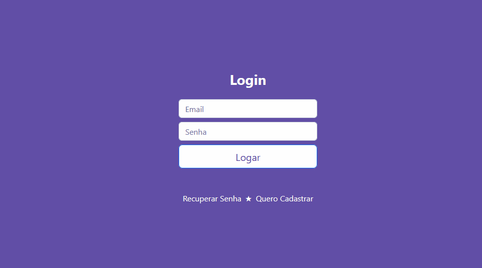

<h1 align="center">Welcome to Events</h1>

So, what's it?

This is a website for publishing events developed with the technologies <b>React, Firebase, Bootstrap...</b>

look how beautiful the website is getting.. thanks bootstrap o/

<h4 align="center">Login and Register</h4>

This website is being created by the course <a href="https://www.udemy.com/course/react-js-firebase-bootstrap-projeto-passo-a-passo/">"React JS + Firebase + Bootstrap: Step-by-Step Project."</a> Check this out devGuys, Rodrigo santana is a great teacher.
